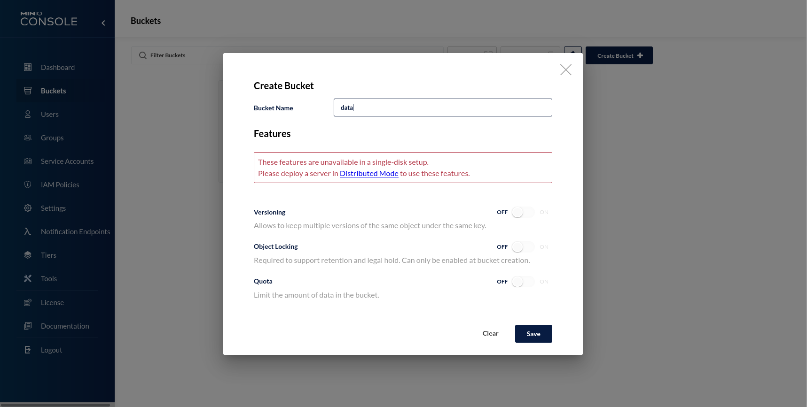
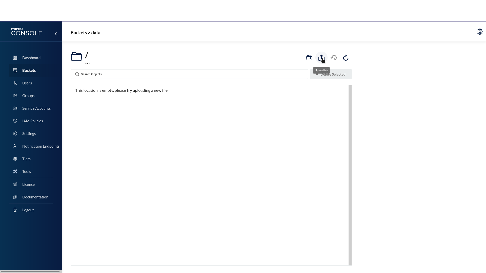

# Setup the local MIAPPE instance

### Run the docker containers

To start the docker containers run

```bash
docker-compose -f docker-compose-prod.yml up -d --force-recreate --remove-orphans
```

### Add a amazonS3 bucket

To add a bucket to the minio container go to `http://localhost:9001/login`. You can login with

```
Username: minio
Password: miniominio
```

After login, create a bucket via the GUI. Name the bucket `data`.


### Upload the Table

Unzip the csv file located in the root directory of the Sandbox repository

```bash
bunzip2 E-CURD-1-query-results.tpms.csv.bz2
```

Go to the bucket you just created and upload the table.


### Populate the MIAPPE Meta-data

Go to `localhost:3000/graphql` and run the following GraphQL mutation

```graphql
mutation {
  addInvestigation(
    id: "zendro_local/MIAPPE/v1.1/investigation/1"
    title: "MY OWN EXTENSION to Araport 11 - RNA-seq of Arabidopsis thaliana Col-0 plants under different growth conditions from multiple studies"
    description: "Using the public Araport 11 data, we study gene expression in our own growing conditions and compare it to the public data"
  ) {
    id
    title
    description
  }
  addStudy(
    id: "zendro_local/MIAPPE/v1.1/study/1"
    title: "Assessment of Gene Expression in Etiolation conditions"
    description: "Arabidopsis thaliana Col-0 plants will be grown in complete absence of light. Gene Expression will be measured with RNA-Seq"
    institution: "At Home, where else? Or maybe on this alien's UFO? Should be possible, too"
    location_country: "Mars, the planet"
    addInvestigation: "zendro_local/MIAPPE/v1.1/investigation/1"
  ) {
    id
    title
    description
    institution
    location_country
    investigation {
      id
      title
    }
  }
  addData_file(
    id: "zendro_local/MIAPPE/v1.1/data_file/1"
    description: "Table of gene expression data, one gene per row. Columns indicate combinations of genotype * sampled tissue * growing conditions (treatment). Cells hold Transcripts Per Million [TPM] values."
    url: "http://localhost:9000/data/E-CURD-1-query-results.tpms.csv"
    addStudy: "zendro_local/MIAPPE/v1.1/study/1"
  ) {
    id
    description
    url
    study {
      id
      title
    }
  }
}
```

The warehouse is now populated with some example MIAPPE metadata. There is also some distributed data available on the 'public' MIAPPE server, that you should be able to request.

In the GraphiQL interface try running a query like

```graphql
{
  investigationsConnection(pagination: { first: 10 }) {
    investigations {
      id
      title
      description
    }
  }
}
```

You should be able to see both the investigation created on your local instance (`zendro_local/MIAPPE/v1.1/investigation/1`) as well as another investigation on the public instance (`zendro_public/MIAPPE/v1.1/investigation/1`)

### Access the browser interface.

After starting the docker services the browser single-page-application (SPA) should be available at `localhost:8080`. The SPA needs to compile, which might take a minute or two.

You can log into the SPA via the default user credentials

```
Username: admin@zen.dro
Password: admin
```

You should be able to browse your data, as well as the distibuted data from the public MIAPPE endpoint.

### Stop the containers

To stop the containers run

```bash
docker-compose -f docker-compose-prod.yml up down
```

# Set up MIAPPE warehouse from empty zendro project

This section describes how to setup the Sandbox from an empty Zendro project using [Zendros CLI](https://github.com/Zendro-dev/zendro) tool.

### Download the CLI

You can download and globally install Zendro's CLI tool via npm using

```bash
npm install -g Zendro-dev/zendro
```

### Setup an empty project

To setup an empty zendro skeleton project, that can be populated with your data-models run

```bash
zendro new -d <my_project>
```

Exchange `<my_project>` with your desired name. This will create a folder containing the zendro skeleton. Move inside via

```bash
cd <my_project>
```

### Define your data-models

Define your data-models in the `data_model_definitions` folder.
You can find the MIAPPE data-models, already set up as a distributed configuration [here](https://github.com/Zendro-dev/Sandbox/tree/MIAPPE_biohackathon2021_local/data_model_definitions.tar.bz2). Download them and put the models into the `data_model_definitions` folder.

```bash
> rm -r data_model_definitions (remove the empty default folder)
> wget https://github.com/Zendro-dev/Sandbox/tree/MIAPPE_biohackathon2021_local/data_model_definitions.tar.bz2
> bunzip2 data_model_definitions.tar.bz2
> tar xf data_model_definitions.tar

```

### Configure the environment

#### Storage configuration

For reasons of simplicity it is easiest to run the docker containers in the host network. The MIAPPE data, by default will be saved in a postgres database. Configure the database as follows in `./config/data_models_storage_config.json`

```json
{
  "default-sql": {
    "storageType": "sql",
    "username": "zendro",
    "password": "zendro",
    "database": "zendro_development",
    "host": "localhost",
    "dialect": "postgres"
  }
}
```

#### Environment variables

Add a `.env` file to the `graphql-server` folder to configure the graphql-server environment. Mandatory variables are

```
ALLOW_ORIGIN="*"
JWT_SECRET="MIAPPE_AND_ZENDRO_ARE_COOL"
```

To configure the environment of the single-page-application edit the `./single-page-app/.env.production` as follows

```
# Mandatory
NEXT_PUBLIC_ZENDRO_GRAPHQL_URL=http://localhost:3000/graphql
NEXT_PUBLIC_ZENDRO_LOGIN_URL=http://localhost:3000/login
NEXT_PUBLIC_ZENDRO_EXPORT_URL=http://localhost:3000/export
NEXT_PUBLIC_ZENDRO_METAQUERY_URL=http://localhost:3000/meta_query
NEXT_PUBLIC_ZENDRO_MAX_UPLOAD_SIZE=500
NEXT_PUBLIC_ZENDRO_MAX_RECORD_LIMIT=10000
# Optional
NEXT_PUBLIC_REDUX_LOGGER=false
# Server
ZENDRO_DATA_MODELS='../data_model_definitions'
```

#### docker-compose

To configure the docker-compose you can edit the provided `docker-compose-<dev|prod>.yml` files. In this case we need to add a minio container to store our data-table on, for us to access the data later via the amazonS3 javascript sdk and `SQL` statements.

Download the `docker-compose-prod.yml` from github and use it instead of the provided one.

```bash
> rm docker-compose-prod.yml (remove the old docker-compose)
> wget https://raw.githubusercontent.com/Zendro-dev/Sandbox/MIAPPE_biohackathon2021_local/docker-compose-prod.yml
```

### Generate the code

To generate the code needed in the graphql-server backend to handle incoming requests and communicate with the databases we need to generate the backend code via the zendro CLI.

```bash
zendro generate-gqs -m
```

The `-m` flag will generate migrations for our postgres database MIAPPE data-models.

If you take a look at the `./graphql-server` folder you will see that for each data-model a `schema`, `resolver` and `model` has been generated. These follow the classic model-view-controller philosophy in separating the logic. All of these files are editable and the user is encouraged to do so, if desired.

The SPA automatically uses [NextJS](https://nextjs.org/) to read from the `data_model_definitions` folder and generate the necessary pages inside the `./single-page-app` folder.

### Start the docker containers

You are now at the stage to start the docker containers. You can go to the top of this `README` and follow the instructions.
